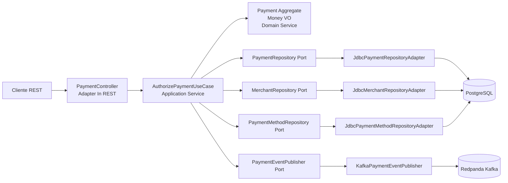

# Payment Native PoC - Java 25 + Spring Boot + GraalVM Native

PoC de microservicio REST orientado a **payment processing**, implementado con **Java 25**, **Spring Boot 4**, **Maven**, **GraalVM Native Image**, arquitectura **hexagonal** y modelado **DDD**.

La funcionalidad principal es autorizar un pago simple:

1. Recibe una solicitud REST de autorización.
2. Valida merchant, método de pago, monto, moneda e idempotencia.
3. Persiste el pago autorizado en PostgreSQL.
4. Publica un evento `PaymentAuthorizedEvent` en Kafka compatible vía Redpanda.

## Estructura del proyecto

```text
payment-native-poc/
├── pom.xml
├── README.md
├── src/
│   ├── main/java/com/axiz/poc/payments/
│   │   ├── domain/                 # Entidades, Value Objects, Domain Services y Events
│   │   ├── application/            # Casos de uso y puertos in/out
│   │   └── adapter/                # Adaptadores REST, JDBC y Kafka
│   └── main/resources/
│       ├── application.yml
│       └── db/migration/           # Flyway DDL
└── infraestructura/
    ├── docker-compose.yml
    ├── Dockerfile.jvm
    ├── Dockerfile.native
    ├── datasets/                   # Scripts de precarga y documentación
    ├── k8s/                        # Manifiestos Kubernetes
    └── requests/                   # Request/response HTTP de ejemplo
```

## Diagrama de arquitectura



## Código principal

- `domain/model/Payment.java`: agregado principal. Autoriza pagos y genera `authorizationCode`.
- `domain/model/Money.java`: Value Object que valida monto positivo y moneda.
- `domain/service/PaymentAuthorizationDomainService.java`: reglas de dominio para merchant y método de pago.
- `application/service/AuthorizePaymentService.java`: caso de uso. Controla idempotencia, persistencia y publicación de eventos.
- `adapter/in/web/PaymentController.java`: endpoint REST.
- `adapter/out/persistence/*`: adaptadores JDBC hacia PostgreSQL.
- `adapter/out/messaging/KafkaPaymentEventPublisher.java`: adaptador Kafka/Redpanda.

## Requisitos

- JDK 25 o GraalVM 25 para compilación nativa.
- Maven 3.9+.
- Docker / Docker Compose.
- Kubernetes local opcional: Minikube, Kind o Docker Desktop Kubernetes.
- sudo dnf groupinstall "Development Tools" para fedora
- sudo dnf install gcc gcc-c++ glibc-devel zlib-devel libstdc++-static

## Levantar infraestructura local

```bash
docker compose -f infraestructura/docker-compose.yml up -d
```

Servicios:

| Componente | URL/Puerto |
|---|---|
| PostgreSQL | `localhost:5432` |
| Redpanda Kafka | `localhost:9092` |
| Redpanda Console | `http://localhost:8081` |

Los datos iniciales están en `infraestructura/datasets/sql/01_seed.sql`.

## Ejecutar en local con JVM

```bash
mvn clean test
mvn spring-boot:run
```

Probar endpoint:

```bash
curl -X POST http://localhost:8080/api/v1/payments/authorizations \
  -H 'Content-Type: application/json' \
  -d '{
    "merchantId":"mrc_demo_001",
    "paymentMethodToken":"tok_visa_4242",
    "amount":125.50,
    "currency":"PEN",
    "idempotencyKey":"idem-demo-001"
  }'
```

## Generar JAR JVM

```bash
mvn clean package -DskipTests
java -jar target/payment-native-poc-0.1.0.jar
```

## Generar binario nativo Linux con GraalVM

```bash
mvn clean -Pnative -DskipTests package 
```
### Ejecutar el binario
```bash
./target/payment-native-poc
```

## Ejecutar con Docker JVM

```bash
mvn clean package -DskipTests
docker build -f infraestructura/Dockerfile.jvm -t payment-native-poc:0.1.0-jvm .
docker run --rm -p 8080:8080 \
  --network host \
  -e DB_URL=jdbc:postgresql://localhost:5432/payments \
  -e DB_USER=payments \
  -e DB_PASSWORD=payments \
  -e KAFKA_BOOTSTRAP_SERVERS=localhost:9092 \
  payment-native-poc:0.1.0-jvm
```

## Ejecutar con Docker Native

```bash
docker build -f infraestructura/Dockerfile.native -t payment-native-poc:0.1.0-native .
docker run --rm -p 8080:8080 \
  --network host \
  -e DB_URL=jdbc:postgresql://localhost:5432/payments \
  -e DB_USER=payments \
  -e DB_PASSWORD=payments \
  -e KAFKA_BOOTSTRAP_SERVERS=localhost:9092 \
  payment-native-poc:0.1.0-native
```

> En Windows/Mac, si `--network host` no resuelve bien, reemplaza `localhost` por `host.docker.internal`.

## Ejecutar en Kubernetes

Para Minikube:

```bash
eval $(minikube docker-env)
docker build -f infraestructura/Dockerfile.native -t payment-native-poc:0.1.0-native .
kubectl apply -f infraestructura/k8s/
kubectl -n payment-poc port-forward svc/payment-native-poc 8080:8080
```

Probar:

```bash
curl http://localhost:8080/actuator/health
```

## Contrato REST

### Request

```json
{
  "merchantId": "mrc_demo_001",
  "paymentMethodToken": "tok_visa_4242",
  "amount": 125.50,
  "currency": "PEN",
  "idempotencyKey": "idem-demo-001"
}
```

### Response

```json
{
  "paymentId": "6f59d25d-0282-4e2b-a5b2-e8d0f3f94a91",
  "status": "AUTHORIZED",
  "authorizationCode": "AUTH-1A2B3C4D",
  "amount": 125.50,
  "currency": "PEN",
  "createdAt": "2026-06-18T20:10:00.000-05:00"
}
```

## Instalar GraalVM

wget https://download.oracle.com/graalvm/25/latest/graalvm-jdk-25_linux-x64_bin.tar.gz
tar -xzf graalvm-jdk-25_linux-x64_bin.tar.gz
sudo mv graalvm-jdk-25* /opt/graalvm

nano ~/.bashrc
export JAVA_HOME=/opt/graalvm
export JAVA_HOME=/opt/graalvm/graalvm-jdk-25.0.3+9.1
export PATH=$JAVA_HOME/bin:$PATH

## Notas de diseño

- Se usa PostgreSQL porque la PoC requiere idempotencia y persistencia transaccional del pago.
- Se usa Redpanda como broker Kafka-compatible para evitar Zookeeper y simplificar la infraestructura local.
- La capa de dominio no depende de Spring ni de infraestructura.
- Los puertos definen contratos de aplicación; los adaptadores resuelven detalles técnicos.
- Flyway crea tablas al iniciar la app; `datasets` carga datos de referencia al iniciar PostgreSQL por primera vez.
